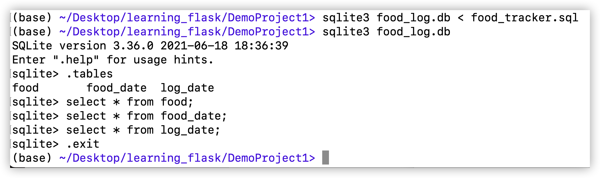

## FoodTracker
### Before start:
1. Start with provided *html* and *css* files.
2. `git commit -m 'DP1v01-Before start'`
### Stage 1: Link *Flask* with provided *html* and *css* files
1. `git commit -m 'DP1v02-Link templates'`
### Stage 2: Create Database
1. Table for dates:
```sql
create table log_date (
    id integer primary key autoincrement,
    entry_date date not null
);
```
2. Table for foods
```sql
create table food (
    id integer primary key autoincrement,
    name text not null,
    protein integer not null,
    carbohydrates integer not null,
    fat integer not null,
    calories integer not null
);
```
3. Table for foods per date
```sql
create table food_date (
    food_id integer not null,
    log_date_id integer not null,
    primary key(food_id, log_date_id)
);
```
4. After create 3 tables in `food_tracker.sql`, pass it to *sqlite* to create the database:
`
sqlite3 food_log.db < food_tracker.sql
`


5. `git commit -m 'DP1v03-Create database'`