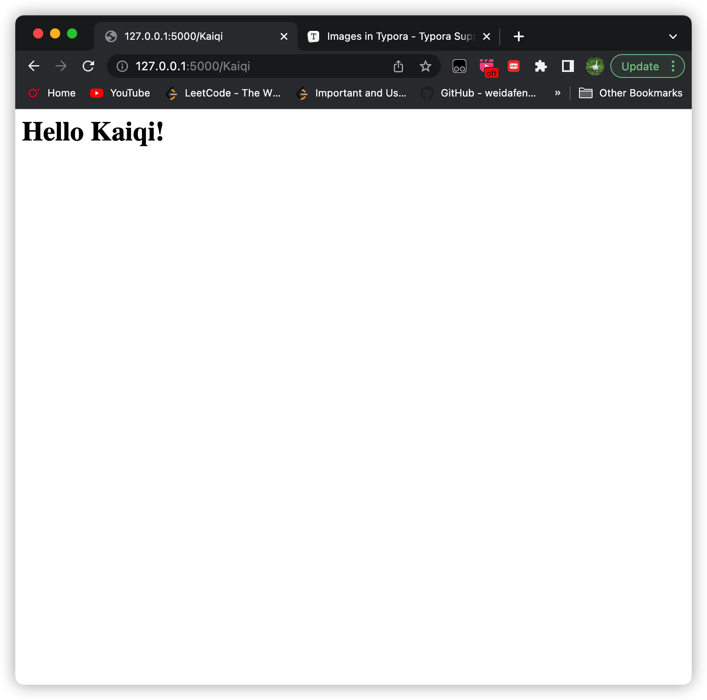

# Learning log
## Date: Jun 3, 2023
## Chapter 1
### Install *flask* 
1. `pip install flask` in *terminal* to intall *flask*
2. Create a new file named *app.py* in this directory. `git commit -m 'd01v01'`The content is as follows:
```python
from flask import Flask

app = Flask(__name__)

@app.route('/')
def index():
    return '<h1>Hello!<h1>'
```
3. Run this by typing `flask run` in *terminal*
4. Add placeholder in *URL*. Change the $5th$ to $7th$ line in *app.py* :
```python
@app.route('/<name>')
def index(name):
    return '<h1>Hello {}!<h1>'.format(name)
```
```python
@app.route('/<name>')
def index(name):
    return f'<h1>Hello {name}!<h1>'
```
5. Both of them will work and the result is like the following. **Notice** that `Kaiqi` is the *value* in *variable* `name` and the last word in the *URL*. `git commit -m 'd01v02--add placeholder`

### Two ways to run *flask*
1. `flask run`
2. **Debug mode:**don't need to type *control+C* every time you make a change. Very useful, error will be reported in *terminal* or *web browser* :
```
export FLASK_DEBUG=1
flask run
```
or add one line of code at the begining of *app.py*
```python
app.config['DEBUG'] = True
```
### Add new route
1. `git commit -m 'd01v03--add new a route: home'`
### Methods in route
1. default methods is `GET`
2. Now have `POST` and `GET`
```python
@app.route('/', methods={'POST', 'GET'})
```